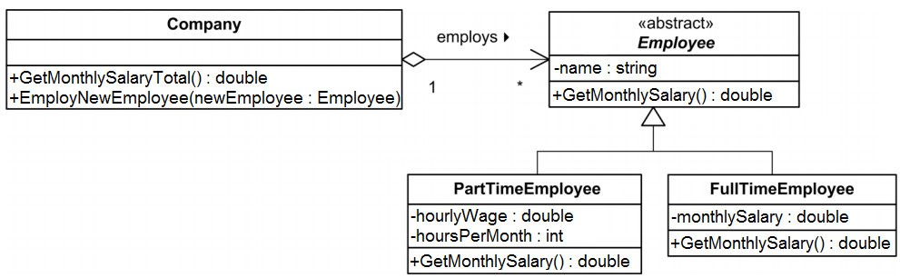

# DNP Exercises 02 - Advanced C#

## Exercise 1, Polymorphism
The following class diagram is part of a company’s administrative system.
A part time employee is paid for each hour he/she is working and is hired for a number of hours per month. A full time employee is paid a fixed salary per month.

Implement the classes shown in the class diagram, including attributes and empty operations.

Implement constructors in the classes: `Employee`, `PartTimeEmployee` and `FullTimeEmployee`. The constructors shall take the necessary parameters to initialize all the attributes in the classes.

Implement the necessary functionality in the `getMonthSalary` operations. The `getMonthSalary` must return the monthly salary for an employee.

Implement the operation `getMonthlySalaryTotal` in the class Company. The operation shall calculate the total salary which the company must pay each month. The calculation should be done by calling `getMonthSalary` on each of the employees and then returning the sum.

Implement the operation `employNewEmployee`. The operation shall add a new `PartTimeEmployee` or `FullTimeEmployee` object to the company’s list of employees.

Implement the necessary test in a main method.

## Exercise 2, Interfaces
Make a copy of your solution from Exercise 1 (implementation of the UML diagram above) and extend the implementation with the following exercise:

The objective of this exercise is to write an `IStudent` interface and a `PartTimeStudent` class that implements it. These may be used in a scenario where employees are allowed to register as part time students; as such one can be an employee and a student at the same time.

- Write an interface, `IStudent`
- Add the method `void Register( int year )`
- Write a class `PartTimeStudent` that inherits from `PartTimeEmployee` and implements the `IStudent` interface. `Register` sets the start year of the education.
Modify your program to allow `PartTimeStudent` classes to be used and tested.

## Exercise 3, Collections
1. Implement an `Animal` class with the following specifications:
    - Animal type as a string
    - Weight as a double value
    - Run speed as an integer value
    - Override `ToString` (specifying the properties of the animal)

1. Create a generic list with 10 Animals (`List<Animal>`) and print all animals in the list.

1. Implement the interface `IComparable` in order to sort the Animals based upon weight and test your implementation by
    - Printing all animals
    - Call `Sort()` method on your list
    - Print all animals again

1. Change your implementation to sort the animals based upon run speed and test it.

## Exercise 4, Creating and Using Generic Stacks
Using the generic `Stack` class (in `System.Collections.Generic`), create an empty stack of integers and an empty stack of strings. Create a static method that takes a generic `Stack` as an argument and a list of generic values (using the params keyword). The method should push all the generic values to the generic stack. Next, use this method to add some values to each stack and print them to the console.

## Exercise 5, Indexers
Create a class `Schedule`. The class should use an indexer to store/access string values in a `Hashtable`. That is, the key should be a given `DateTime` object, and the corresponding value should be a `string` containing the classes of that given date.

Create an instance of the `Schedule` class and test it with your own schedule.

Expand the `Schedule` class with a second indexer that overloads the first one. This indexer should take a date `string` (instead of a `DateTime` object) and return the same results as the first indexer by parsing the string to a `DateTime` object.

## Exercise 6, Params modifier
Implement an `Add` method of a `Calculator` class that can take either an array of integers, or an arbitrary amount of integers as argument (hint: use the `params` modifier). Test your method by printing results to the console.

## Exercise 7, Extension methods
Create a `Time` class with two integer properties, `Hours` and `Minutes`. Create an extension method for the + operator that takes two `Time` objects and add them together, returning a new `Time` object. 

Create another extension method that adds an integer value (in minutes) to a `Time` object and returns a new `Time` object.

Override the `ToString` method so that printing a Time object to the console displays the time in the format *“Hours: X, Minutes: Y”*

## Exercise 8, Delegates
Create a notifier `delegate` that takes a `string` as an argument and returns `void`. Implement two methods, `SayHello` and `SayGoodBye` that prints *“Hello [name]”* and *“Goodbye [name]”*, respectively, to the console. 

Use the notifier `delegate` to first print *“Hello [name]”* to the console when the application is run. Next, modify the code so that *“Goodbye [name]”* is printed instead. Lastly, modify and add to the code so that *“Hello [name]”* and *“Goodbye [name]”* are both printed to the console.
